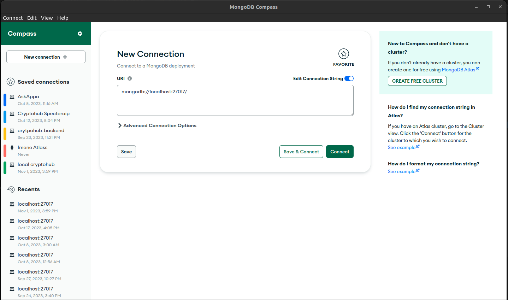
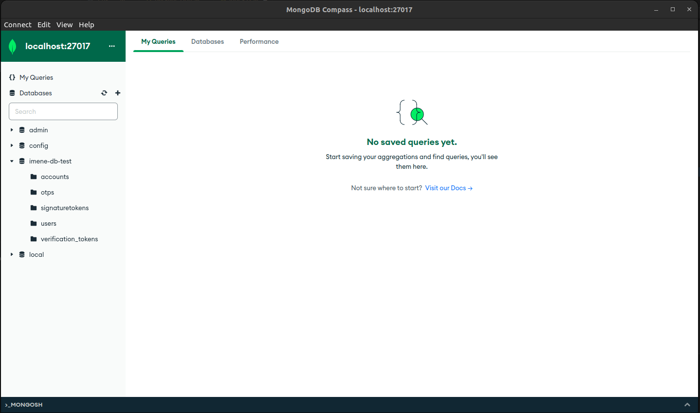

# Mongo Db

Mongo db is no . It is document oriented database. It is schema less database.

## SQL vs NoSQL

| SQL                                                                                                    | NoSQL                                                                                                                                   |
| ------------------------------------------------------------------------------------------------------ | --------------------------------------------------------------------------------------------------------------------------------------- |
| primarily called as Relational Databases (RDBMS)                                                       | primarily called as non-relational or distributed database.                                                                             |
| table based databases                                                                                  | document based, key-value pairs, graph databases or wide-column stores.                                                                 |
| have predefined schema                                                                                 | NoSQL databases have dynamic schema for unstructured data.                                                                              |
| vertically scalable                                                                                    | horizontally scalable.                                                                                                                  |
| uses SQL ( structured query language ) for defining and manipulating the data, which is very powerful. | In NoSQL database, queries are focused on collection of documents. Sometimes it is also called as UnQL (Unstructured Query Language).   |
| examples: MySql, Oracle, Sqlite, Postgres and MS-SQL.                                                  | NoSQL database examples: MongoDB, BigTable, Redis, RavenDb, Cassandra, Hbase, Neo4j and CouchDb                                         |
| For complex queries:  good fit for the complex query intensive environment                             | For complex queries:  not good fit for complex queries.                                                                                 |
| not best fit for hierarchical data storage.                                                            | NoSQL database fits better for the hierarchical data storage as it follows the key-value pair way of storing data similar to JSON data. |

**Example**

Lets say we have a user data that we want to store , this user have the following data

```js
{
    name: "John Doe",
    age: 25,
    status: "active",
    idCard: {
        type: "national",
        number: "1234567890"
        expiry: "2025-12-31"
    }
}
```

if we were to store this in a relational database we would have to create a table for the user and another table for the idCard and then we would have to create a relationship between the two tables.

In a NoSQL database we can store the data as it is without having to create a relationship between two tables, be cause wee will store it in one document.

*Fields in a nested document can be indexed separately. This means that queries can filter on the nested fields without scanning the entire document.*

### Exploring MongoDb With Mongo Shell

Mongo shell is a javascript shell that allows us to interact with the database.

To start the mongo shell we can run the following command in the terminal

```js
mongosh
```

By default this will connect you to the local mongo database.

Once you are in the mongo shell you can run the following command to see the databases that are available

```js
show dbs
```

To create/use a new database you can run the following command

```js
use <database-name>
```

  *this will create a new database if it does not exist, switch to it if it is already created*

To see the current database you are using you can run the following command

```js
db
```

To create a new collection you can run the following command

```js
db.createCollection("<collection-name>")
```

To see the collections in the current database you can run the following command

```js
show collections
```

To insert a document into a collection you can run the following command

```js
db.<collection-name>.insertOne({name: "John Doe", age: 25, status: "active"})
```

To insert multiple documents into a collection you can run the following command

```js
db.<collection-name>.insertMany([{name: "John Doe", age: 25, status: "active"}, {name: "Jane Doe", age: 25, status: "active"}])
```

To find all the documents in a collection you can run the following command

```js
db.<collection-name>.find()
```

To find all the documents in a collection and format the output you can run the following command

```js
db.<collection-name>.find().pretty()
```

To find all the documents in a collection that match a certain criteria you can run the following command

```js
db.<collection-name>.find({status: "active"})
```

To find all the documents in a collection that match a certain criteria and format the output you can run the following command

```js
db.<collection-name>.find({status: "active"}).pretty()
```

To count the number of documents in a collection you can run the following command

```js
db.<collection-name>.countDocuments()
```


### Compass 

Compass is a GUI for mongo db that allows us to interact with the database.

* To start compass you can just double click on the application.

* A window similar to this will show up 



* click on the connect button and it will connect you to the local mongo database. (if you want to connect to a remote database you can click on the connect to button and enter the connection string)
* Once connected you can see your databases on the left, click on any of them to see their collections and documents etc...




### Final Thoughts

We are not going to go deeper on this topic, because we will be mostly interacting with the database using mongoose from our node application. and we will be using the mongo shell and compass to debug and test our application only.